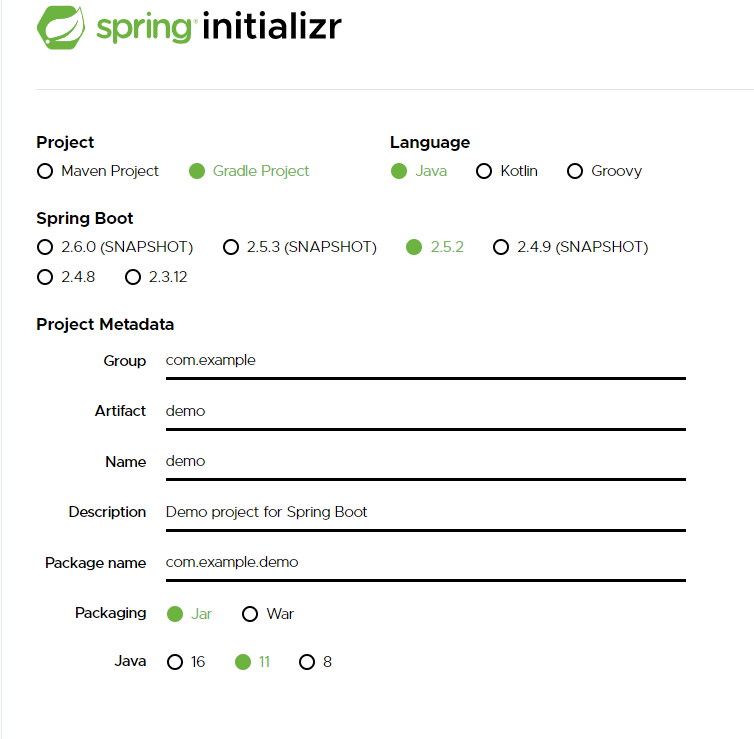
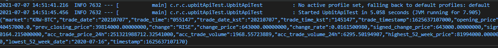

# Crypto Generator Hello World

## 🎁 목차
- [Crypto Generator Hello World](#crypto-generator-hello-world)
  - [🎁 목차](#-목차)
  - [개요](#개요)
  - [0. 프로젝트 생성](#0-프로젝트-생성)
  - [1. Upbit api](#1-upbit-api)
  - [2. Spring-boot x Upbit](#2-spring-boot-x-upbit)
    - [2.1. Dependencies 추가](#21-dependencies-추가)
    - [2.1. 테스트코드 작성](#21-테스트코드-작성)
    - [2.2. 테스트코드 실행](#22-테스트코드-실행)

## 개요
본 장부터 **코인자동거래봇(CryptoGenerator)**의 제작과정을 담는다.
거래소는 업비트를 이용하고 Spring-boot으로 CryptoGenerator를 제작하였다.

## 0. 프로젝트 생성
필자는 Spring-boot 프로젝트를 생성할 때 [spring initializr](https://start.spring.io/)를 이용한다.
- spring initializr
  


- Project: `Gradle`
  - maven보다 가독성이 뛰어나고 속도도 빨라 사용한다.
- Packaging: `Jar`
  - 프로젝트를 빌드하고 `java`로 실행할 것이기에 선택한다.
- 이하 나머지는 자기의 편의에 맞게 선택한다.

## 1. Upbit api
업비트에서는 다양한 api를 제공해줌으로써 사용자에게 편의를 제공한다.
(binance에 비해 퀄리티는 떨어지지만..)

먼저 인터넷 주소창에 다음을 입력해보자. 무엇이 보이는가?
> `https://api.upbit.com/v1/ticker?markets=KRW-BTC`

아마 Json형태의 출력을 볼 수 있을 것이다.
이것이 바로 비트코인의 실시간 시세이다.
우리는 향후 이를 DTO로 저장할 것이다.

> 업비트에서 제공하는 api정보와 목록들은 다음 링크에서 확인할 수 있다.
> [업비트 개발자 센터](https://docs.upbit.com/)

## 2. Spring-boot x Upbit
먼저 spring-boot과 upbit api를 연동해보자.
테스트코드를 생성하자.

### 2.1. Dependencies 추가
`build.gradle`에 필요한 라이브러리를 추가한다.
```gradle
dependencies {
	implementation (
		'org.springframework.boot:spring-boot-starter-web',   // Rest	
		'com.google.code.gson:gson',                          // Gson
	)
	testImplementation 'org.springframework.boot:spring-boot-starter-test'
}
```
- `org.springframework.boot:spring-boot-starter-web`
  - Rest call을 위해 사용할 라이브러리이다.
- `com.google.code.gson:gson`
  - Json object의 직렬화/역직렬화를 위해 사용할 json 라이브러리이다.
  - 
### 2.1. 테스트코드 작성
`src/test/java/com/rivernine/cryptogenerator`아래에 `upbitApiTest`를 만들었다.

- `UpbitApiTest.java`
```java
package com.rivernine.cryptogenerator.upbitApiTest;

import com.google.gson.JsonObject;
import com.google.gson.Gson;

import org.junit.jupiter.api.Test;
import org.junit.jupiter.api.extension.ExtendWith;
import org.mockito.junit.jupiter.MockitoExtension;
import org.springframework.boot.test.context.SpringBootTest;
import org.springframework.web.client.RestTemplate;

@ExtendWith(MockitoExtension.class)
@SpringBootTest
public class UpbitApiTest {  
  
  @Test
  public void getMarketsTest() {
    RestTemplate restTemplate = new RestTemplate();
    Gson gson = new Gson();

    String jsonString = restTemplate.getForObject("https://api.upbit.com/v1/ticker?markets=KRW-BTC", String.class);
    JsonObject[] jsonObjectArray = gson.fromJson(jsonString, JsonObject[].class);

    System.out.println(jsonObjectArray[0].toString());
  }
}
```
- `RestTemplate restTemplate = new RestTemplate();`
  - Rest call을 도와줄 인스턴스를 선언한다.
- `Gson gson = new Gson();`
  - Json object 핸들링을 도와줄 인스턴스를 선언한다.
- `restTemplate.getForObject("https://api.upbit.com/v1/ticker?markets=KRW-BTC", String.class);`
  - upbit api를 호출하고 결과를 `String`형태로 받는다.
- `gson.fromJson(jsonString, JsonObject[].class);`
  - `gson`을 통해 `String`을 JsonObject로 **Unmarshal**해준다.
- `System.out.println(jsonObjectArray[0].toString());`
  - JsonArray의 첫번째 원소를 프린트한다.
  
### 2.2. 테스트코드 실행
테스트코드를 실행하면 다음과 같이 출력되며 실시간 시세를 조회할 수 있다.


이로써 spring-boot에서 upbit api를 사용 가능하게 되었다!!

---