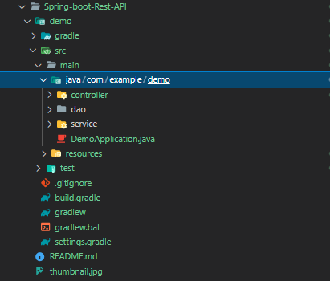

# Spring-boot Rest API
## 🎁 목차
- [Spring-boot Rest API](#Spring-boot-Rest-API)
  - [🎁 목차](#-목차)
  - [0. 개요](#0.-개요)
## 0. 개요
* Spring-boot을 이용하여 간단한 Rest API를 작성한다.
* 프로젝트 생성은 [**이곳**](!https://velog.io/@rivernine/Spring-boot-Hello-world)을 참조한다.  
* MVC(Controller - Service - DAO) 형태를 사용한다.
* 기본 폴더 구성은 다음과 같다.
  - 
## 1. Controller
* 