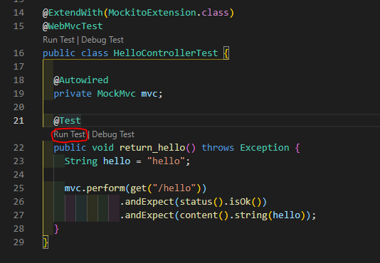
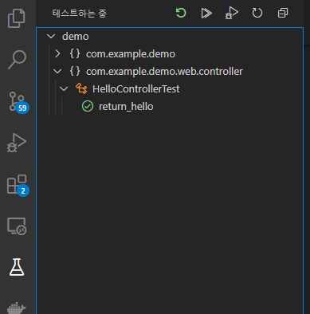

# Spring-boot TDD
## 🎁 목차
- [Spring-boot TDD](#spring-boot-tdd)
  - [🎁 목차](#-목차)
  - [0. 개요](#0-개요)
  - [1. dependency 추가](#1-dependency-추가)
  - [2. Controller 작성](#2-controller-작성)
  - [3. Test 작성](#3-test-작성)
  - [4. Test](#4-test)
  - [5. Start](#5-start)
  
## 0. 개요
프로젝트 생성은 [**이곳**](!https://velog.io/@rivernine/Spring-boot-Hello-world)을 참조한다.  

**TDD (Test-driven Development)** 란 테스트 주도 개발로서 테스트가 주가 되어 개발하는 방법론이다.
TDD를 사용함으로써 우리는 
* was를 포함한 무거운 spring-boot의 재시작 없이도 코드반영을 확인할 수 있다.
* print를 찍지 않아도 검증이 가능하게 된다.
* 새로운 기능 개발로 인해 기존 기능에 생기는 문제를 사전 예방할 수 있다.
  
## 1. dependency 추가
`build.gradle`에 다음을 추가한다.
```groovy
dependencies {
  // RestAPI
  implementation 'org.springframework.boot:spring-boot-starter-web'  
  // Test
  testImplementation 'org.springframework.boot:spring-boot-starter-test'
}

test {
	useJUnitPlatform()
}
```

## 2. Controller 작성
1. package 생성
`/web/controller`폴더를 만든다.
2. controller class 생성
해당 폴더 아래에 `HelloController.java`를 만든다.
```java
package com.rivernine.demo.web.controller;

import org.springframework.web.bind.annotation.RestController;
import org.springframework.web.bind.annotation.GetMapping;

@RestController
public class HelloController {

  @GetMapping("/hello")
  public String hello(){
    return "hello";
  }
}
```
- `@RestController` 
  - 컨트롤러를 JSON을 반환하게 해준다.(
  - 기존에는 `@ResponseBody`를 메소드마다 선언해 주었다.
- `@GetMapping`
  - HTTP method 중 Get 요청을 받을 수 있는 API를 만들어준다.
  - 기존에는 `@RequestMapping(method = RequestMethod.GET)`을 사용했음

## 3. Test 작성
1. package 생성
`test`아래에 동일 구조의 폴더를 만든다. `web/controller`
2. test controller class 생성
해당 폴더 아래에 `HelloControllerTest.java`를 만든다.
```java
package com.rivernine.demo.web.controller;

import static org.springframework.test.web.servlet.request.MockMvcRequestBuilders.get;
import static org.springframework.test.web.servlet.result.MockMvcResultMatchers.content;
import static org.springframework.test.web.servlet.result.MockMvcResultMatchers.status;

import org.junit.jupiter.api.Test;
import org.junit.jupiter.api.extension.ExtendWith;
import org.mockito.junit.jupiter.MockitoExtension;
import org.springframework.beans.factory.annotation.Autowired;
import org.springframework.boot.test.autoconfigure.web.servlet.WebMvcTest;
import org.springframework.test.web.servlet.MockMvc;

@ExtendWith(MockitoExtension.class)
@WebMvcTest
public class HelloControllerTest {
  
  @Autowired
  private MockMvc mvc;

  @Test
  public void return_hello() throws Exception {
    String hello = "hello";

    mvc.perform(get("/hello"))
              .andExpect(status().isOk())
              .andExpect(content().string(hello));
  }
}
```
- `@ExtendWith`
  - Spring-boot 테스트와 JUnit사이의 연결자이다.
- `@WebMvcTest`
  - 여러 Spring-boot 어노테이션 중 Web 어노테이션이다.
  - 선언할 경우 `@Controller`, `@ControllerAdvice`를 사용할 수 있다.
- `@Autowired`
  - Spring이 관리하는 Bean을 주입받는다.
- `private MockMvc mvc`
  - Spring MVC 테스트의 시작점이다.
  - 이 클래스를 통해 HTTP GET, POST등 API 테스트를 할 수 있다.
- `mvc.perform(get("/hello"))`
  - MockMvc를 통해 /hello 주소로 HTTP GET 요청을 한다.
- `.andExpect(status().isOk())`
  - `mvc.perform`의 결과를 검증한다.
  - HTTP Header의 Status를 검증한다.
- `.andExpect(content().string(hello))`
  - `mvc.perform`의 결과를 검증한다.
  - 응답 본문의 내용을 검증한다.

## 4. Test
각 method별로 테스트를 실행해 볼 수 있다.
필자는 `VSCode`를 사용하고 있고, `Java Extension Pack`을 추가하여 사용한다.
1. Test 실행
`Run Test`를 누르면 unit test를 진행할 수 있다.

2. 결과 확인
`디버크 콘솔`을 보자.
was를 필요로하는 Controller Test이기에 Spring-boot application이 실행된 것을 볼 수 있다.
Test 결과는 VSCode 좌측 플라스크 아이콘을 클릭하여 확인할 수 있다.

 

## 5. Start
```sh
# 빌드
./gradlew build
# Spring-boot 실행
java -jar ./build/lib/*.jar

# 테스트
curl localhost:8080/hello   # hello
```