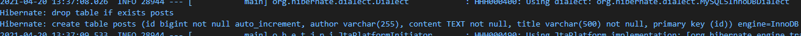
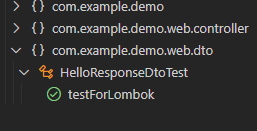

# Spring-boot JPA
## 🎁 목차
- [Spring-boot JPA](#spring-boot-jpa)
  - [🎁 목차](#-목차)
  - [0. 개요](#0-개요)
  - [1. Dependency 추가](#1-dependency-추가)
  - [2. DTO 작성](#2-dto-작성)
  - [3. 테스트코드 작성](#3-테스트코드-작성)
  - [4. Test](#4-test)
  - [5. Start](#5-start)
  
## 0. 개요
**JPA (Java Persistence API)** Spring-boot에서 RDB의 관리를 용이하게 해주는 API이다. (= 자바 표준 ORM) 
ORM(Object Relational Mapping): DB와 객체 지향 프로그래밍 간의 데이터를 변환하는 프로그래밍 기법
  
## 1. Dependency 추가
`build.gradle`에 다음을 추가한다.
```groovy
dependencies {
	implementation 'org.springframe'
  annotationProcessor 'org.projectlombok:lombok'
}
```

## 2. DTO 작성
1. package 생성
`/web/dto`폴더를 만든다.
2. dto class 생성
해당 폴더 아래에 `HelloResponseDto.java`를 만든다.
```java
package com.example.demo.web.dto;

import lombok.Getter;
import lombok.RequiredArgsConstructor;

@Getter
@RequiredArgsConstructor
public class CryptoResponseDto {
  private final String name;
  private final int amount;
}
```
- `@Getter` 
  - get method를 생성해준다.
- `@RequiredArgsConstructor`
  - 생성자를 만들어준다.  

## 3. 테스트코드 작성
1. package 생성
`test`아래에 동일 구조의 폴더를 만든다. `web/dto`
2. test controller class 생성
해당 폴더 아래에 `HelloResponseDtoTest.java`를 만든다.
```java
package com.example.demo.web.dto;

import org.junit.jupiter.api.Test;
import static org.assertj.core.api.Assertions.assertThat;

public class HelloResponseDtoTest {

  @Test
  public void testForLombok() {
    String name = "test";
    int amount = 1000;

    HelloResponseDto dto = new HelloResponseDto(name, amount);

    assertThat(dto.getName()).isEqualTo(name);
    assertThat(dto.getAmount()).isEqualTo(amount);
  }
}

```
- `new HelloResponseDto(name, amount);`
  - 테스트를 위해 객체를 생성한다.
- `@assertThat`
  - 테스트 중 두 값을 비교하는데에 사용
  - 메소드 체이닝이 지원되어 `isEqualTo()`와 같이 사용할 수 있음
  - `JUnit` 지원 메소드와 `assertj` 둘 중 하나를 선택 사용 

## 4. Test
1. Test 실행
`Run Test`를 누르면 unit test를 진행할 수 있다.

2. 결과 확인
`디버크 콘솔`에 아무것도 표시되지 않는다.
Controller 테스트와는 다르게 was를 필요로하지 않기 때문이다.
하지만 Test 결과는 VSCode 좌측 플라스크 아이콘을 클릭하여 확인할 수 있다.

 
* `HelloResponseDto` 클래스에는 getter, constructor가 선언되지 않았음에도 코드는 정상적으로 작동된다.
이와 같이 Lombok을 사용하여 개발생산성을 높일 수 있다.

## 5. Start
```sh
# 빌드
./gradlew build
# Spring-boot 실행
java -jar ./build/lib/*.jar

curl localhost:8080/hello   # hello
```

---
*참고서적: 스프링부트와 AWS로 혼자 구현하는 웹 서비스*
