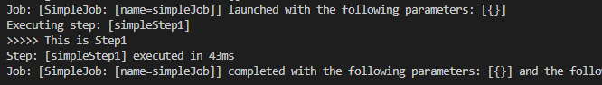

# Spring-boot Batch with H2
## 🎁 목차
- [Spring-boot Batch with H2](#spring-boot-batch-with-h2)
  - [🎁 목차](#-목차)
  - [0. 개요](#0-개요)
  - [1. Dependency 추가](#1-dependency-추가)
  - [2. Batch 활성화](#2-batch-활성화)
  - [3. Job 작성](#3-job-작성)
  - [4. 실행](#4-실행)
  
## 0. 개요
**Batch**란 일괄처리를 의미한다.
batch application은 다음을 만족하여야 한다.
  - 대용량 데이터: 대용량 데이터 처리
  - 자동화: 사용자 개입 없이 실행
  - 견고성: 잘못된 데이터를 충돌/중단 없이 처리
  - 신뢰성: 로깅, 알림 등 오류 추적
  - 성능: 지정한 시간 안에 처리 완료, 타 어플리케이션의 방해없는 독립성
  
batch는 `Job`의 집합이다.
  - `Job`은 `Step`의 집합
  - `Step`은 `ItemReader` + `ItemProcessor` + `ItemWriter`로 이루어져 있다.
  - `ItemRearder`: batch data를 읽어오는 인터페이스. (DB, file, xml 등)
  - `ItemProcessor`: 읽어온 data를 가공/처리
  - `ItemWriter`: 가공/처리한 데이터를 DB, file 등에 저장

Spring-boot batch를 사용하려면 다음과 같은 **메타 데이터 테이블**이 필요하다.
- BATCH_STEP_EXECUTION
- BATCH_STEP_EXECUTION_CONTEXT
- BATCH_JOB_INSTANCE
- BATCH_JOB_EXECUTION
- BATCH_JOB_EXECUTION_PARAMS
- BATCH_JOB_EXECUTION_CONTEXT

**h2**와 같은 인메모리 db를 사용하면 spring-boot이 테이블들을 자동으로 생성해준다
본 문서에서는 **h2**를 사용하여 Batch를 실행한다.

## 1. Dependency 추가
`build.gradle`에 다음을 추가한다.
```groovy
dependencies {  
  implementation 'org.springframework.boot:spring-boot-starter-batch'
  implementation 'com.h2database:h2'
}
```
- `org.springframework.boot:spring-boot-starter-batch`
  - spring-boot batch 라이브러리
- `com.h2database:h2`
  - H2(Inmemory database) 라이브러리

## 2. Batch 활성화
1. `DemoApplication.java`수정
main class에 `@EnableBatchProcessing`을 추가한다.
```java
@EnableBatchProcessing
@SpringBootApplication
public class DemoApplication {

	public static void main(String[] args) {
		SpringApplication.run(DemoApplication.class, args);
	}
}
```
- `@EnableBatchProcessing`
  - 배치기능 활성화

## 3. Job 작성
1. package 생성
`job` 폴더를 만든다.
2. job class 생성
해당 폴더 아래에 `SimpleJobConfiguration.java`를 만든다.
```java
@Slf4j
@RequiredArgsConstructor
@Configuration
public class SimpleJobConfiguration {
  private final JobBuilderFactory jobBuilderFactory; 
  private final StepBuilderFactory stepBuilderFactory; 

  @Bean
  public Job simpleJob() {
    return jobBuilderFactory.get("simpleJob")
            .start(simpleStep1())
            .build();
  }

  @Bean
  public Step simpleStep1() {
    return stepBuilderFactory.get("simpleStep1")
            .tasklet((contribution, chunkContext) -> {
              log.info(">>>>> This is Step1");
              return RepeatStatus.FINISHED;
            })
            .build();
  }
}
```
- `@Slf4j`
  - Log 사용을 위한 Lombok 어노테이션
- `@RequiredArgsConstructor`
  - 생성자 자동 생성
- `@Configuration`
  - spring batch의 모든 job은 `@Configuration`으로 등록해서 사용한다.
- `jobBuilderFactory.get("simpleJob")`
  - simpleJob이란 이름의 batch job을 생성한다.
- `stepBuilderFactory.get("simpleStep1")`
  - simpleStep1 이란 이름의 batch Step을 생성한다.
- `tasklet()`
  - step 안에서 수행될 기능을 명시한다.

## 4. 실행
```sh
# 빌드
./gradlew build
# Spring-boot 실행
java -jar ./build/lib/*.jar
```

job이 실행되는 로그를 확인할 수 있다.


---
**모든 소스는 [깃허브](https://github.com/rivernine/velog/tree/master/Spring-boot)에 올려놓았다.**
**참고링크: [jojoldu 블로그](https://jojoldu.tistory.com/)**
