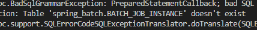
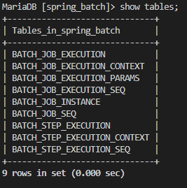
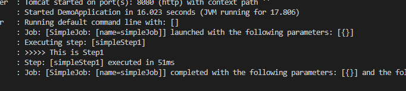

# Spring-boot Batch with MySQL
## 🎁 목차
- [Spring-boot Batch with MySQL](#spring-boot-batch-with-mysql)
  - [🎁 목차](#-목차)
  - [0. 개요](#0-개요)
  - [1. MySQL 띄우기](#1-mysql-띄우기)
  - [2. DB 설정](#2-db-설정)
  - [3. Dependency 추가](#3-dependency-추가)
  - [4. application.yml 작성](#4-applicationyml-작성)
  - [5. 테이블 생성](#5-테이블-생성)
  - [6. 실행](#6-실행)

  
## 0. 개요
[이전 포스트](https://velog.io/@rivernine/Spring-boot-Batch)와 같이 `h2`와 같은 인메모리 db를 사용하면 spring-boot이 **메타데이터 테이블**들을 자동으로 생성해준다. 
하지만 `mysql`과 같은 db를 사용하면 직접 생성해야 한다.

## 1. MySQL 띄우기
편의를 위해 mysql을 ubuntu에서 docker container로 띄운다.
```sh
mkdir ~/db-source
touch ~/db-source/docker-compose.yaml
```
```yaml
# db-source
version: '3.1'

networks:
  etl-example:

services:
  db-source:
    image: mariadb:latest
    container_name: db-source
    restart: always
    environment:
      TZ: Asia/Seoul
      # mysql을 처음 서비스할때에 root password가 필요하다.
      # 아래의 환경변수를 포함하여 올린 후 지워준다.
      # MYSQL_ROOT_PASSWORD: ${PASSWORD}
    networks:
      - etl-example
    ports:
      - 3306:3306
    volumes:
      - /data/db/data:/var/lib/mysql
      - /data/db/config:/etc/mysql/conf.d
```
```sh
# container run
docker-compose -f ~/db-source/docker-compose.yaml up -d
```

## 2. DB 설정
mysql에 database를 만들고 사용자를 추가한다.
```sh
# db 생성
docker exec -it db-source bash
mysql -u root -p
## 패스워드 입력

CREATE DATABASE study_db default CHARACTER SET UTF8;
SHOW DATABASES;

# spring에서 접속할 것 이므로 localhost가 아닌 %를 써준다.
GRANT ALL PRIVILEGES ON spring_batch.* TO $ID@'%' IDENTIFIED BY "$PASSWORD";

exit

mysql -u $ID -p
## $PASSWORD 입력

SHOW DATABASES;
## spring_batch가 보이는지 확인
```

## 3. Dependency 추가
`build.gradle`에 다음을 추가한다.
```groovy
dependencies {  
	// jdbc
	implementation 'org.springframework.boot:spring-boot-starter-jdbc'
  // mysql
	implementation 'mysql:mysql-connector-java'
}
```

## 4. application.yml 작성
`mysql`을 사용하기 위하여 `resources/application.properties`파일을 다시 작성한다.
설정이 복잡해지므로 `*.properties`대신 `*.yml`로 전환한다.
```yml
spring:
  profiles: mysql
  datasource:
    hikari:
      # MYSQL_ADDR:PORT/DATABASE
      jdbc-url: jdbc:mysql://192.168.56.103:3306/spring_batch
      # mysql databases를 access하기위한 계정
      username: rivernine
      password: rivernine
      # mysql용 jdbc드라이버
      driver-class-name: com.mysql.jdbc.Driver
```

## 5. 테이블 생성
여기까지 진행한 후 실행을 시켜보면 해당 테이블이 없다는 것을 확인할 수 있다.



따라서 메타데이터 테이블을 추가를 해주어야 한다.
스키마들은 [여기](https://github.com/spring-projects/spring-batch/tree/master/spring-batch-core/src/main/resources/org/springframework/batch/core)에서 찾을 수 있다.

본 문서에서는 `schema-mysql.sql`을 사용한다.
`shcema-mysql.sql`의 모든 스키마를 `mysql`에서 실행한다.

```sh
mysql -u $USER -p

use spring_batch;
# shcema-mysql.sql 붙여넣기
show tables;
```

다음 테이블들이 추가된 것을 확인한다.


## 6. 실행
```sh
# 빌드
./gradlew build
# Spring-boot 실행
java -jar ./build/lib/*.jar
```


그리고 다시 실행을 하면 오류없이 정상적으로 동작하는 것을 볼 수 있다.

---
**모든 소스는 [깃허브](https://github.com/rivernine/velog/tree/master/Spring-boot)에 올려놓았다.**
**참고링크: [jojoldu 블로그](https://jojoldu.tistory.com/)**
