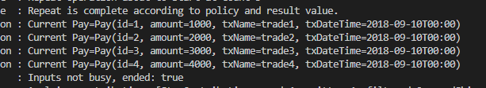

# Spring-boot Batch ItemReader
## 🎁 목차
- [Spring-boot Batch ItemReader](#spring-boot-batch-itemreader)
  - [🎁 목차](#-목차)
  - [0. 개요](#0-개요)
  - [1. ItemReader](#1-itemreader)
  - [2. CursorItemReader](#2-cursoritemreader)
    - [2.1. Create JdbcCursorItemReader](#21-create-jdbccursoritemreader)
    - [2.2. Insert sample data into MySQL](#22-insert-sample-data-into-mysql)
    - [2.3. application.yml 수정](#23-applicationyml-수정)
    - [2.4. 실행](#24-실행)
    - [2.5. 로그 확인](#25-로그-확인)
    - [2.6. 주의사항](#26-주의사항)
  - [3. PagingItemReader](#3-pagingitemreader)
    - [3.1. JdbcPagingItemReader](#31-jdbcpagingitemreader)
    - [3.2. JpaPagingItemReader](#32-jpapagingitemreader)
    - [4. ItemReader 주의 사항](#4-itemreader-주의-사항)
  
## 0. 개요
Step은 Tasklet단위로 처리되고, Tasklet 중  **ChunkOrientedTasklet**을 통해 Chunk를 처리하며 이는 ItemReader, ItemWriter, ItemProcessor로 구성된다.

>**Chunk**란 각 commit사이에 처리되는 row 수를 뜻한다. 
>한 마디로 Chunk단위로 트랜잭션을 다루는 것을 의미한다. 따라서 실패할 경우, Chunk 만큼 rollback된다.

- ItemReader: 데이터를 하나 읽어온다.
- ItemProcessor: 읽어온 데이터를 가공한다. (데이터를 Chunk단위 만큼 별도 공간에 모은 후 ItemWriter에게 전달한다..)
- ItemWriter: 일괄 저장한다.

ItemReader, ItemProcessor에서 1건씩 다루고, **ItemWriter에서 Chunk단위로 처리된다.**

> **Page Size**는 한번에 조회할 Item의 양, **Chunk Size**는 한번에 처리될 트랜잭션 단위이다.
> 예를들어, `PageSize=10, ChunkSize=50`이면 ItemReader에서 **5번의 Page조회**가 일어나고, **1번의 트랜잭션이 발생하여 Chunk가 처리**된다.
>
> Page Size를 상당히 크게하고, Page Size와 Chunk Size를 일치하면 성능이 향상된다고 한다.
> **여기서 2개의 값을 일치시키는 것을 강력히 권장한다.**

## 1. ItemReader
Spring Batch의 **ItemReader**는 데이터를 읽어온다.
  - 입력 데이터
  - File
  - DB
  - Java Message Service 등 다른 소스
  - Customized Reader

DatabaseReader는 ItemReader의 구현체 중 하나로 **Cursor**와 **Paging** 타입으로 나뉜다.
- Cursor
  - **Streaming**의 개념
  - DB와 커넥션을 맺은 후, Cursor를 한칸씩 옮기며 지속적으로 데이터를 가져온다.
- Paging
  - **Page** 단위로 한번에 데이터를 조회한다.

2개 방식의 구현체는 다음과 같다. 본 문서에서는 **bold**표시 된 구현체를 다룬다.
- Cursor 기반 ItemReader 구현체
  - **JdbcCursorItemReader**
  - HibernateCursorItemReader
  - StoredProcedureItemReader
- Paging 기반 ItemReader 구현체
  - **JdbcPagingItemReader**
  - HibernatePagingItemReader
  - **JpaPagingItemReader**

## 2. CursorItemReader
CursorItemReader는 Streaming으로 데이터를 처리한다.
Cursor Itemreader중 대표적인 **JdbcCursorItemReader**이다.

### 2.1. Create JdbcCursorItemReader
- `JdbcCursorItemReaderJobConfiguration.java`
```java
@Slf4j
@RequiredArgsConstructor
@Configuration
public class JdbcCursorItemReaderJobConfiguration {
  
  private final JobBuilderFactory jobBuilderFactory;
  private final StepBuilderFactory stepBuilderFactory;
  private final DataSource dataSource;

  private static final int chunkSize = 10;

  @Bean
  public Job jdbcCursorItemREaderJob() {
    return jobBuilderFactory.get("jdbcCursorItemReaderJob")
            .start(jdbcCursorItemReaderStep())
            .build();
  }

  @Bean 
  public Step jdbcCursorItemReaderStep() {
    return stepBuilderFactory.get("jdbcCursorItemReaderStep")            
            .<Pay, Pay>chunk(chunkSize)
            .reader(jdbcCursorItemReader())
            .writer(jdbcCursorItemWriter())
            .build();
  }

  @Bean 
  public JdbcCursorItemReader<Pay> jdbcCursorItemReader() {
    return new JdbcCursorItemReaderBuilder<Pay>()
            .fetchSize(chunkSize)
            .dataSource(dataSource)
            .rowMapper(new BeanPropertyRowMapper<>(Pay.class))
            .sql("SELECT id, amount, tx_name, tx_date_time FROM pay")
            .name("jdbcCursorItemReader")
            .build();
  }

  private ItemWriter<Pay> jdbcCursorItemWriter() {
    return list -> {
      for (Pay pay: list){
        log.info("Current Pay={}", pay);
      }
    };
  }
}
```
- `Processor`는 `Reader`, `Writer`와는 다르게 필수가 아니다.
- `CursorItemReader`의 가장 큰 장점은 데이터를 **Streaming** 할 수 있다는 것이다.
- `<Pay, Pay>chunk(chunkSize)`
  - `<Pay, >` : Reader에서 반환할 타입
  - `<, Pay>` : Writer에 넘어올 타입
  - `chunkSize` : Chunk transaction 범위
- `fetchSize(chunkSize)`
  - DB에서 한번에 가져올 데이터 양
  - 데이터를 FetchSize만큼 가져와 `read()`를 통해 하나씩 가져온다.
- `dataSource(dataSource)`            
  - DB에 접근하기 위해 사용할 Datasource 객체를 할당
- `rowMapper(new BeanPropertyRowMapper<>(Pay.class))`            
  - 쿼리 결과를 Java 인스턴스로 매핑하기 위한 Mapper
- `sql("SELECT id, amount, tx_name, tx_date_time FROM pay")`            
  - Reader로 사용할 쿼리문
- `name("jdbcCursorItemReader")`            
  - Reader의 이름
            
<br>

- `Pay.java`
```java
@ToString
@Getter
@Setter
@NoArgsConstructor
@Entity
public class Pay {
  private static final DateTimeFormatter FORMATTER = DateTimeFormatter.ofPattern("yyyy-MM-dd hh:mm:ss");

  @Id
  @GeneratedValue(strategy = GenerationType.IDENTITY)
  private Long id;
  private Long amount;
  private String txName;
  private LocalDateTime txDateTime;

  public Pay(Long amount, String txName, String txDateTime) {
    this.amount = amount;
    this.txName = txName;
    this.txDateTime = LocalDateTime.parse(txDateTime, FORMATTER);
  }

  public Pay(Long id, Long amount, String txName, String txDateTime) {
    this.id = id;
    this.amount = amount;
    this.txName = txName;
    this.txDateTime = LocalDateTime.parse(txDateTime, FORMATTER);
  }
}
```

### 2.2. Insert sample data into MySQL
```sql
create table pay (
  id         bigint not null auto_increment,
  amount     bigint,
  tx_name     varchar(255),
  tx_date_time datetime,
  primary key (id)
) engine = InnoDB;

insert into pay (amount, tx_name, tx_date_time) VALUES (1000, 'trade1', '2018-09-10 00:00:00');
insert into pay (amount, tx_name, tx_date_time) VALUES (2000, 'trade2', '2018-09-10 00:00:00');
insert into pay (amount, tx_name, tx_date_time) VALUES (3000, 'trade3', '2018-09-10 00:00:00');
insert into pay (amount, tx_name, tx_date_time) VALUES (4000, 'trade4', '2018-09-10 00:00:00');
```

### 2.3. application.yml 수정
```yaml
logging.level.org.springframework.batch: DEBUG
```

### 2.4. 실행
```sh
./gradlew build -x test

java -jar ./build/lib/*.jar --job.name=jdbcCursorItemReaderJob
```

### 2.5. 로그 확인
DB 내용을 조회하여 writer의 log.info를 실행하는 것을 볼 수 있다.



### 2.6. 주의사항
Cursor는 하나의 Connection을 Batch가 끝날 때 까지 사용한다.
때문에 Batch가 끝나기 전에 Connection이 먼저 끊어질 수 있으므로 **DB의 SocketTimeout을 큰 값으로 설정해야 한다.**

그래서 Batch의 수행시간이 오래 걸리는 경우 PagingItemReader가 좋다.
**Paging의 경우 한 페이지를 읽을 때마다 Connection을 맺고 끊기 때문에 아무리 많은 데이터라도 Timeout과 부하없이 수행될 수 있다.**

## 3. PagingItemReader
PagingItemreader는 반드시 정렬(`Order`)가 포함되어야 한다.
본 문서에서는 **JdbcPagingItemReader**와 **JpaPagingItemReader**를 다룬다.
### 3.1. JdbcPagingItemReader
1. Create JdbcPagingItemReader
- `JdbcPagingItemReaderJobConfiguration.java`
```java
@Slf4j
@RequiredArgsConstructor
@Configuration
public class JdbcPagingItemReaderJobConfiguration {
  private final JobBuilderFactory jobBuilderFactory;
  private final StepBuilderFactory stepBuilderFactory;
  private final DataSource dataSource;

  private static final int chunkSize = 10;

  @Bean
  public Job jdbcPagingItemReaderJob() throws Exception {
    return jobBuilderFactory.get("jdbcPagingItemReaderJob")
            .start(jdbcPagingItemReaderStep())
            .build();
  }

  @Bean
  public Step jdbcPagingItemReaderStep() throws Exception {
    return stepBuilderFactory.get("jdbcPagingItemReaderStep")
            .<Pay, Pay>chunk(chunkSize)
            .reader(jdbcPagingItemReader())
            .writer(jdbcPagingItemWriter())
            .build();
  }

  @Bean
  public JdbcPagingItemReader<Pay> jdbcPagingItemReader() throws Exception {
    Map<String, Object> parameterValues = new HashMap<>();
    parameterValues.put("amount", 2000);

    return new JdbcPagingItemReaderBuilder<Pay>()
                .pageSize(chunkSize)
                .fetchSize(chunkSize)
                .dataSource(dataSource)
                .rowMapper(new BeanPropertyRowMapper<>(Pay.class))
                .queryProvider(createQueryProvider())
                .parameterValues(parameterValues)
                .name("jdbcPagingItemReader")
                .build();
  }

  private ItemWriter<Pay> jdbcPagingItemWriter() {
    return list -> {
      for (Pay pay: list) {
        log.info("Current Pay={}", pay);
      }
    };
  }

  @Bean
  public PagingQueryProvider createQueryProvider() throws Exception {
    SqlPagingQueryProviderFactoryBean queryProvider = new SqlPagingQueryProviderFactoryBean();
    queryProvider.setDataSource(dataSource);
    queryProvider.setSelectClause("id, amount, tx_name, tx_date_time");
    queryProvider.setFromClause("from pay");
    queryProvider.setWhereClause("where amount >= :amount");

    Map<String, Order> sortKeys = new HashMap<>(1);
    sortKeys.put("id", Order.ASCENDING);

    queryProvider.setSortKeys(sortKeys);

    return queryProvider.getObject();
  }

}
```

- `parameterValues(parameterValues)`
  - 쿼리에 대한 매개 변수 값의 Map을 지정한다.
  - where절에 선언된 파라미터 변수명과 일치해야한다.    
- `PagingQueryProvider`            
  - JdcbCursorItemReader를 사용할 때는 단순 String으로 쿼리를 생성했지만
    PagingItemReader에서는 `PagingQueryProvider`를 통해 쿼리를 생성했다.

    그 이유는 각 Database에서 Paging을 지원하는 자체 전략이 존재하기 때문이다.
    이러한 이유로 Spring Batch에는 각 DB 의 Paging전략에 맞춰 구현되어야 하는데,
    DB마다 Provider코드를 바꿔야하니 불편함이 많다.

    그래서 Spring Batch는 `SqlPagingQueryProviderFactoryBean`을 통해 Datasource 설정값을 보고 **Provider를 자동으로 선택한다**.

2. 실행
```sh
./gradlew build -x test

java -jar ./build/lib/*.jar --job.name=jdbcPagingItemReaderJob
```

3. 로그 확인

where절이 잘 적용된 것을 확인할 수 있다.


`LIMIT 10`은 `JdbcPagingItemReader`에서 선언된 pageSize에 맞게 자동으로 쿼리에 추가되었다.

### 3.2. JpaPagingItemReader
JPA에서는 Cursor 기반 Database 접근을 지원하지 않는다.
1. Create JpaPagingItemReader
- `JpaPagingItemReaderJobConfiguration.java`
```java
@Slf4j
@RequiredArgsConstructor
@Configuration
public class JpaPagingItemReaderJobConfiguration {
  private final JobBuilderFactory jobBuilderFactory;
  private final StepBuilderFactory stepBuilderFactory;
  private final EntityManagerFactory entityManagerFactory;

  private int chunkSize = 10;

  @Bean
  public Job jpaPagingItemReaderJob() {
    return jobBuilderFactory.get("jpaPagingItemReaderJob")
            .start(jpaPagingItemReaderStep())
            .build();
  }

  @Bean
  public Step jpaPagingItemReaderStep() {
    return stepBuilderFactory.get("jpaPagingItemReaderStep")
            .<Pay, Pay>chunk(chunkSize)
            .reader(jpaPagingItemReader())
            .writer(jpaPagingItemWriter())
            .build();
  }

  @Bean
  public JpaPagingItemReader<Pay> jpaPagingItemReader() {
    return new JpaPagingItemReaderBuilder<Pay>()
                .name("jpaPagingItemReader")
                .entityManagerFactory(entityManagerFactory)
                .pageSize(chunkSize)
                .queryString("SELECT p FROM Pay p WHERE amount >= 2000")
                .build();
  }

  private ItemWriter<Pay> jpaPagingItemWriter() {
    return list -> {
      for (Pay pay: list){
        log.info("Current Pay={}", pay);
      }
    };
  }
}
```

2. 실행
```sh
./gradlew build -x test

java -jar ./build/libs/*.jar --job.name=jpaPagingItemReaderJob
```

3. 로그 확인


마찬가지로 잘 작동한다.

### 4. ItemReader 주의 사항
- JpaRepository를 ListItemReader, QueueItemReader에 사용하면 안된다.
  - ex) `new ListItemReader<>(jpaRepository.findByAge(age))`
  - 이 경우, paging과 cursor 구현이 없어 대규모 데이터 처리가 불가하다.
- Hibernate, JPA 등 영속성 컨텍스트가 필요한 Reader 사용 시 fetchSize와 chunkSize는 같은 값을 유지해야 한다.

---
**모든 소스는 [깃허브](https://github.com/rivernine/velog/tree/master/Spring-boot)에 올려놓았다.**
**참고링크: [jojoldu 블로그](https://jojoldu.tistory.com/)**