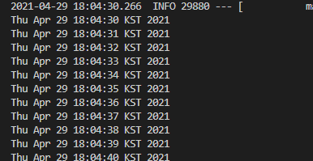

# Spring-boot Scheduler
## 🎁 Contents
- [Spring-boot Scheduler](#spring-boot-scheduler)
  - [🎁 Contents](#-contents)
  - [0. Summary](#0-summary)
  - [1. Spring-boot Framework Scheduler](#1-spring-boot-framework-scheduler)
    - [1.1. Enable Scheduling](#11-enable-scheduling)
    - [1.2 Create Job](#12-create-job)
    - [1.3 Execute](#13-execute)
    - [1.4 Check](#14-check)
  - [2. Quartz](#2-quartz)
    - [2.1. About Quartz](#21-about-quartz)
  - [3. Jenkins](#3-jenkins)
    - [3.1. Create `docker-compose.yaml`](#31-create-docker-composeyaml)
    - [3.2. Run Jenkins](#32-run-jenkins)
    - [3.3. Init Jenkins](#33-init-jenkins)
  
## 0. Summary
Linux crontab과 같은 scheduler를 Spring-boot에서 다뤄보자.
본 문서에서는 다음과 같은 job scheduler를 다룰 것이다.
- Spring-boot Framework Scheduler
- Quartz
- Jenkins

## 1. Spring-boot Framework Scheduler
Spring-boot 자체적으로 지원하는 Scheduler로 `@EnableScheduling, @Scheduled`만으로 간단하게 구현 가능하다.
**간단한 Job Scheduling을 할 때 사용하면 좋다.**
### 1.1. Enable Scheduling
Spring-boot 진입점에 `@EnableScheduling`을 선언한다.
- `DemoApplication.java`
```java
@EnableScheduling
@SpringBootApplication
public class DemoApplication {
  public static void main(String[] args) {
    SpringApplication.run(DemoApplication.class, args);
  }
}
```

### 1.2 Create Job
주기적으로 실행될 Job을 구현한다.
- `SpringFrameworkScheduler.java`
```java
@Component
public class SpringFrameworkScheduler {
  
  @Scheduled(fixedDelay = 1000)
  public void printJob() {
    System.out.println(new Date());
  }
}
```
- `@Scheduled(fixedDelay = 1000)`
  - 1000ms 주기로 메소드를 반복한다.
  - `fixedDelay`외에도 `fixedRate, initialDelay, cron`등 다양한 옵션을 사용할 수 있다.
- 다음은 자주 쓰이는 `cron`의 옵션이다.
  - `(cron = "초 분 시 일 월 요일")`
  - `*` : all
  - `?` : none
  - `m` : array
  - `a-b` : a부터 b까지
  - `a/b` : a부터 b마다. a, a+b, a+b+b, ...
### 1.3 Execute
```sh
./gradlew build -x test

java -jar ./build/libs/*.jar
```

### 1.4 Check


1000ms주기로 출력이 되는 것을 확인할 수 있다.

## 2. Quartz
자바로 개발된 오픈소스 Job Scheduling 라이브러리로 보다 다양한 기능을 제공한다.
Clustering기능을 제공하고 여러 플러그인을 제공한다.
다만 완벽한 Cluster간 로드 분산은 안된다.

**Quartz에서는 Job을 관리하기가 쉽지않다.**
전반적인 scheduler관리를 위해 관리 UI를 따로 만들어야 한다면 그것또한 큰 공수가 들어갈 것이다.
그래서 우리가 흔히 알고있는 CI Tool, **Jenkins**를 적극 이용할 것이다.

### 2.1. About Quartz
- `Job`
  - `execute` 인터페이스를 제공한다.
  - 실제 작업을 `execute` 메서드에 구현하면 된다.
- `JobDataMap`
  - Job 인스턴스가 실행할 때 사용할 수 있는 정보를 담을 수 있다.
- `JobDetail`
  - Job을 실행시키기 위한 정보를 담고있다.
  - JobDetail 정보를 기반으로 Trigger가 스케줄링한다.
- `Trigger`
  - Job을 실행시킬 스케줄링 조건을 담고있다.
  - `SimpleTrigger, CronTrigger`로 지정할 수 있다.
- `Misfire Instructions`
  - 불발된 Trigger에 대한 policy를 지원한다.
- `Listener`
   -  `JobListener`
      -  Job 실행 전/후
   -  `TriggerListener`
      -  Trigger 발생/불발/완료
- `JobStore`
  - Job과 Trigger를 `RAMJobStore`나 `JDBCJobStore`방식으로 저장 가능하다.

## 3. Jenkins
Jenkins를 통해 배치를 실행할 수 있다. 
만일 이미 Jenkins를 사용하고 있다면 **배치 Jenkins와 배포 Jenkins를 분리하는 것을 추천한다.**

### 3.1. Create `docker-compose.yaml`
```sh
vim docker-compose.yaml
```

```yaml
version: '2'

networks:
  ci:

services:
  jenkins:
    container_name: jenkins
    image: jenkins/jenkins
    # 원하는 경로에 volume 마운트
    volumes:
      - ~/jenkins/:/var/jenkins_home
    networks:
      - ci
```

### 3.2. Run Jenkins
```sh
docker-comopse up -d

# 확인
docker ps
docker logs -f jenkins
```

### 3.3. Init Jenkins
Jenkins를 올린 서버의 8080포트를 들어가서 Password를 입력해야한다.
초기 패스워드는 다음 경로에서 확인 가능하다.
```sh
# 1. docker log
docker logs -f jenkins

# 2. read password file
cat /var/jenkins_home/secrets/initialAdminPassword
```

패스워드를 입력하고 플러그인들을 다운받고 다음단계에서 계정을 생성하면 Jenkins 초기셋팅이 완료된다.
> 향후 Jenkins에서 원하는 플러그인을 모두 받을 수 있다.


---
**모든 소스는 [깃허브](https://github.com/rivernine/velog/tree/master/Spring-boot)에 올려놓았다.**
