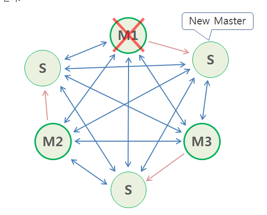
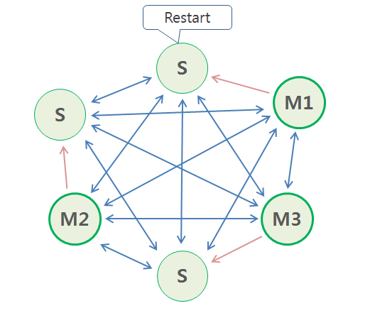

# Redis Cluster failover

## 🎁 목차
- [Redis Cluster failover](#redis-cluster-failover)
  - [🎁 목차](#-목차)
  - [개요](#개요)
  - [1. Fail (master: 3)](#1-fail-master-3)
    - [1.1. node down](#11-node-down)
    - [1.2. check](#12-check)
    - [1.3 restart node](#13-restart-node)
    - [1.4 check](#14-check)
  - [2. Fail (master: 3, slave: 3)](#2-fail-master-3-slave-3)
    - [2.1. scenario](#21-scenario)
    - [2.2. node down](#22-node-down)
    - [2.3. check](#23-check)
    - [2.4. master node restart](#24-master-node-restart)
    - [2.5. check](#25-check)

## 개요
Redis Cluster에서 장애가 나면 어떻게 될까?
본 문서에서는 두가지 시나리오를 다룬다.
- 3개의 master 중 1개의 master fail
- 3개의 master, 3개의 slave 중 1개의 master fail

## 1. Fail (master: 3)
slave가 없는 master에 장애가 발생하면 어떻게 되는지 알아보자.
7001, 7002, 7003포트에는 모두 redis master가 서비스되고, 7002노드를 정지해본다.
### 1.1. node down
```sh
$ docker exec -it redis-master-2 bash
$ redis-cli -c -p 7002
127.0.0.1:7002> debug segfault
Error: Connection reset by peer
(0.86s)
```
- `debug segfault`
  - node를 정지한다.

### 1.2. check
docker log를 살펴본다.
cluster state가 fail로 바뀐 것을 볼 수 있다.

```sh
docker logs -f redis-master-2

1:M 21 Jun 2021 07:28:21.434 * FAIL message received from 3c349984f0bb61490c170ab68f2617a35d9581d6 about 79816979a6dd4b226e476121dd385ed6c25e5151
1:M 21 Jun 2021 07:28:21.435 # Cluster state changed: fail
```

이제 7001번 노드에 접속하여 cluster 정보를 살펴보자
```sh
$ docker exec -it redis-master-1 bash
$ redis-cli -c -p 7001

127.0.0.1:7001> set a b
(error) CLUSTERDOWN The cluster is down

127.0.0.1:7001> cluster info
cluster_state:fail
cluster_slots_assigned:16384
cluster_slots_ok:10922
cluster_slots_pfail:0
cluster_slots_fail:5462
cluster_known_nodes:3
cluster_size:3
cluster_current_epoch:3
cluster_my_epoch:1
cluster_stats_messages_ping_sent:435
cluster_stats_messages_pong_sent:461
cluster_stats_messages_sent:896
cluster_stats_messages_ping_received:459
cluster_stats_messages_pong_received:434
cluster_stats_messages_meet_received:2
cluster_stats_messages_fail_received:1
cluster_stats_messages_received:896

127.0.0.1:7001> cluster nodes
027a002ecc012b61a5997f151ad01bccbb65d1c0 127.0.0.1:7001@17001 myself,master - 0 1624260599000 1 connected 0-5460
3c349984f0bb61490c170ab68f2617a35d9581d6 127.0.0.1:7003@17003 master - 0 1624260599580 3 connected 10923-16383
79816979a6dd4b226e476121dd385ed6c25e5151 127.0.0.1:7002@17002 master,fail - 1624260495388 1624260493352 2 disconnected 5461-10922
```
- `127.0.0.1:7001> set a b`
  - master가 3개 미만인 상태라 데이터 삽입이 불가능하다.
- `cluster_state:fail`
  - cluster상태가 fail로 이용이 불가능하다.
- `127.0.0.1:7001> cluster nodes`
  - 노드들의 상태정보를 검색한 결과 7002번 master가 disconnected된 것을 확인할 수 있다.

### 1.3 restart node
7002번 master를 재시작한다.
```sh
$ docker restart redis-master-2
redis-master-2

$ docker ps | grep redis-master-2
de5e52fb0428        redis:6.2.3         "docker-entrypoint.s…"   9 minutes ago       Up 8 seconds                            redis-master-2
```

### 1.4 check
docker log를 확인해보자.
```sh
$ docker logs redis-master-2
1:M 21 Jun 2021 07:30:56.966 * Node configuration loaded, I'm 79816979a6dd4b226e476121dd385ed6c25e5151
```
- `Node configuration loaded`
  - 기존의 구성이 load되어진다.

노드들의 상태정보를 확인해보면 3개의 master 모두 정상적으로 작동되고 있는것을 확인할 수 있다.
```sh
$ docker exec -it redis-master-1 bash
$ redis-cli -c -p 7001
127.0.0.1:7001> cluster nodes
027a002ecc012b61a5997f151ad01bccbb65d1c0 127.0.0.1:7001@17001 myself,master - 0 1624260765000 1 connected 0-5460
3c349984f0bb61490c170ab68f2617a35d9581d6 127.0.0.1:7003@17003 master - 0 1624260767224 3 connected 10923-16383
79816979a6dd4b226e476121dd385ed6c25e5151 127.0.0.1:7002@17002 master - 0 1624260766218 2 connected 5461-10922
```

이제 cluster가 정상화된 것을 볼 수 있다.
```sh
127.0.0.1:7001> set a b
-> Redirected to slot [15495] located at 127.0.0.1:7003
OK
127.0.0.1:7003> get a
"b"
127.0.0.1:7003> set b c
-> Redirected to slot [3300] located at 127.0.0.1:7001
OK
127.0.0.1:7001> set c d
-> Redirected to slot [7365] located at 127.0.0.1:7002
OK
127.0.0.1:7002> get c
"d"
```

## 2. Fail (master: 3, slave: 3)
redis cluster에서는 Master-Slave구조를 통해 cluster의 영속성을 보장해준다.
slave는 master의 데이터를 복제하고 master 장애 발생 시 slave가 master로 승격하여 cluster를 유지한다.
master-slave구조에서의 장애 발생 시나리오를 살펴보자.

### 2.1. scenario
시나리오는 다음과 같다.
- 
- master 3, slave 3의 구조를 가진다.
- |이름|주소|클러스터|
  |:-:|:-:|:-:|
  |node1|192.168.56.100|redis-master-1, redis-slave-3|
  |node2|192.168.56.101|redis-master-2, redis-slave-1|
  |node3|192.168.56.102|redis-master-3, redis-slave-2|
- `redis-master-2`가 fail이 나는 상황이다.

### 2.2. node down
192.168.56.101에 접속하여 container를 중지한다.
```sh
$ docker stop redis-master-2
```

### 2.3. check
192.168.56.102에 접속하여 slave의 로그를 확인한다.(101번 master의 slave는 102번 서버에 있다.)
```sh
$ docker logs -f redis-slave-2
1:S 23 Jun 2021 07:49:33.581 # Connection with master lost.
1:S 23 Jun 2021 07:49:33.582 * Caching the disconnected master state.
1:S 23 Jun 2021 07:49:33.582 * Reconnecting to MASTER 192.168.56.101:7001
1:S 23 Jun 2021 07:49:33.582 * MASTER <-> REPLICA sync started
1:S 23 Jun 2021 07:49:33.583 # Error condition on socket for SYNC: Connection refused
...
1:S 23 Jun 2021 07:49:38.756 # Failover election won: I'm the new master.
1:M 23 Jun 2021 07:49:38.757 # Cluster state changed: ok
```
- `Failover election won: I'm the new master.`
  - `redis-master-2`가 fail이 나고, `redis-slave-2`가 master로 승격한 것을 확인할 수 있다.
  
cluster 상태 정보를 검색해보자.
```sh
$ docker exec -it redis-master-1 bash
$ redis-cli -c -p 7001
127.0.0.1:7001> cluster nodes
30a99d668af3ddda16e2a9d3ee97fb53a5ebfa6d 192.168.56.100:7002@17002 myself,slave 22110f4ea10f11a8cb6ea283dedfc27c6ffabc07 0 1624434594000 3 connected
22110f4ea10f11a8cb6ea283dedfc27c6ffabc07 192.168.56.102:7001@17001 master - 0 1624434596533 3 connected 10923-16383
094af2ab1db0d147d7f475f3954429ae7d18dee0 192.168.56.102:7002@17002 master - 0 1624434595524 7 connected 5461-10922
c952f5ef4783b5c19129bc630b88e8e3bf602622 192.168.56.101:7001@17001 master,fail - 1624434574580 1624434573000 2 disconnected
5b56d458a0d8e64d5f40ece0a99713dcb9c70723 192.168.56.100:7001@17001 master - 0 1624434595524 1 connected 0-5460
e0d9ee09b593889cd093d217a16a0b535e6abef2 192.168.56.101:7002@17002 slave 5b56d458a0d8e64d5f40ece0a99713dcb9c70723 0 1624434595626 1 connected
```
- `094af2ab1db0d147d7f475f3954429ae7d18dee0 192.168.56.102:7002@17002 master`
  - 기존에 slave였던 192.168.56.102:7002가 master로 승격한 것을 확인할 수 있다.
- `c952f5ef4783b5c19129bc630b88e8e3bf602622 192.168.56.101:7001@17001 master,fail`
  - 장애가 발생한 master노드는 fail상태이고, disconnected 되어있다.

### 2.4. master node restart
master "였던" `redis-master-2`노드를 재기동한다.
```sh
$ docker restart redis-master-2
```

### 2.5. check
재기동을 해도 `redis-master-2`는 master로 승격되지 않는다.
`redis-slave-2`가 master를 유지한다.
```sh
$ docker exec -it redis-master-1 bash
$ redis-cli -c -p 7001
127.0.0.1:7001> cluster nodes
30a99d668af3ddda16e2a9d3ee97fb53a5ebfa6d 192.168.56.100:7002@17002 myself,slave 22110f4ea10f11a8cb6ea283dedfc27c6ffabc07 0 1624434646000 3 connected
22110f4ea10f11a8cb6ea283dedfc27c6ffabc07 192.168.56.102:7001@17001 master - 0 1624434646576 3 connected 10923-16383
094af2ab1db0d147d7f475f3954429ae7d18dee0 192.168.56.102:7002@17002 master - 0 1624434646071 7 connected 5461-10922
c952f5ef4783b5c19129bc630b88e8e3bf602622 192.168.56.101:7001@17001 slave 094af2ab1db0d147d7f475f3954429ae7d18dee0 0 1624434647079 7 connected
5b56d458a0d8e64d5f40ece0a99713dcb9c70723 192.168.56.100:7001@17001 master - 0 1624434646575 1 connected 0-5460
e0d9ee09b593889cd093d217a16a0b535e6abef2 192.168.56.101:7002@17002 slave 5b56d458a0d8e64d5f40ece0a99713dcb9c70723 0 1624434646576 1 connected
```
- 
