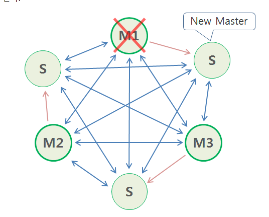

# redis cluster

## setup
```sh
# 메모리 사용량이 허용량을 초과할 경우, overcommit을 처리하는 방식 결정하는 값을 "항상"으로 변경
$ sudo sysctl vm.overcommit_memory=1
$ sudo echo "vm.overcommit_memory=1" >> /etc/sysctl.conf 
$ sudo sysctl -a | grep vm.overcommit

# 서버 소켓에 Accept를 대기하는 소켓 개수 파라미터를 변경
$ sudo sysctl -w net.core.somaxconn=1024
$ sudo echo "net.core.somaxconn=1024" >> /etc/sysctl.conf 
$ sudo sysctl -a | grep somaxconn

# THP(Transparent Huge Pages) 기능이 Enable 되어 있는 경우 Redis에서는 이를 Disable 시킬 것을 권장한다.
```


## docker-compose.yaml
```yaml
version: '3'
services:
  redis-master-1:
    container_name: redis-master-1
    image: redis:6.2.3
    network_mode: "host"   
    command: redis-server /etc/redis.conf   
    volumes: 
    - ./redis-master-1.conf:/etc/redis.conf
    restart: always
    ports:
    - 7001:7001
    - 17001:17001

  redis-master-2:
    container_name: redis-master-2
    image: redis:6.2.3
    network_mode: "host"     
    command: redis-server /etc/redis.conf 
    volumes:  
      - ./redis-master-2.conf:/etc/redis.conf
    restart: always
    ports:
      - 7002:7002
      - 17002:17002

  redis-master-3:
    container_name: redis-master-3
    image: redis:6.2.3
    network_mode: "host"      
    command: redis-server /etc/redis.conf
    volumes:  
      - ./redis-master-3.conf:/etc/redis.conf
    restart: always
    ports:
      - 7003:7003
      - 17003:17003
```

## redis.conf
```conf
; redis-master-1.conf
port 7001
cluster-enabled yes
cluster-config-file nodes.conf
cluster-node-timeout 3000
appendonly yes

; redis-master-2.conf
port 7002
cluster-enabled yes
cluster-config-file nodes.conf
cluster-node-timeout 3000
appendonly yes

; redis-master-3.conf
port 7003
cluster-enabled yes
cluster-config-file nodes.conf
cluster-node-timeout 3000
appendonly yes
```

## Start cluster
1. create cluster
```sh
$ docker exec -it redis-master-1 bash
$ redis-cli --cluster create 127.0.0.1:7001 127.0.0.1:7002 127.0.0.1:7003

>>> Performing hash slots allocation on 3 nodes...
Master[0] -> Slots 0 - 5460
Master[1] -> Slots 5461 - 10922
Master[2] -> Slots 10923 - 16383
M: 218ffd51a2d025a6af640bd9325db0de38750242 127.0.0.1:7001
   slots:[0-5460] (5461 slots) master
M: f1f6a1c8fea47794c07184ccb9b15c9ba31f2033 127.0.0.1:7002
   slots:[5461-10922] (5462 slots) master
M: 885bbe387799a7d1f724d2aa4bee267b14935823 127.0.0.1:7003
   slots:[10923-16383] (5461 slots) master
Can I set the above configuration? (type 'yes' to accept): yes
>>> Nodes configuration updated
>>> Assign a different config epoch to each node
>>> Sending CLUSTER MEET messages to join the cluster
Waiting for the cluster to join
.
>>> Performing Cluster Check (using node 127.0.0.1:7001)
M: 218ffd51a2d025a6af640bd9325db0de38750242 127.0.0.1:7001
   slots:[0-5460] (5461 slots) master
M: f1f6a1c8fea47794c07184ccb9b15c9ba31f2033 127.0.0.1:7002
   slots:[5461-10922] (5462 slots) master
M: 885bbe387799a7d1f724d2aa4bee267b14935823 127.0.0.1:7003
   slots:[10923-16383] (5461 slots) master
[OK] All nodes agree about slots configuration.
>>> Check for open slots...
>>> Check slots coverage...
[OK] All 16384 slots covered.
```

2. check
```sh
$ redis-cli -c -p 7001
127.0.0.1:7001> cluster info
cluster_state:ok
cluster_slots_assigned:16384
cluster_slots_ok:16384
cluster_slots_pfail:0
cluster_slots_fail:0
cluster_known_nodes:3
cluster_size:3
cluster_current_epoch:3
cluster_my_epoch:1
cluster_stats_messages_ping_sent:107
cluster_stats_messages_pong_sent:111
cluster_stats_messages_sent:218
cluster_stats_messages_ping_received:109
cluster_stats_messages_pong_received:107
cluster_stats_messages_meet_received:2
cluster_stats_messages_received:218

127.0.0.1:7001> cluster nodes
f1f6a1c8fea47794c07184ccb9b15c9ba31f2033 127.0.0.1:7002@17002 master - 0 1624425301254 2 connected 5461-10922
885bbe387799a7d1f724d2aa4bee267b14935823 127.0.0.1:7003@17003 master - 0 1624425302260 3 connected 10923-16383
218ffd51a2d025a6af640bd9325db0de38750242 127.0.0.1:7001@17001 myself,master - 0 1624425301000 1 connected 0-5460
```

## Start cluster with slave

|이름|주소|클러스터|
|-|-|-|
|node1|192.168.56.100|redis-master-1, redis-slave-3|
|node2|192.168.56.101|redis-master-2, redis-slave-1|
|node3|192.168.56.102|redis-master-3, redis-slave-2|


1. create cluster
```sh
$ docker exec -it redis-master-1 bash
$ redis-cli --cluster create 192.168.56.100:7001 192.168.56.101:7001 192.168.56.102:7001 192.168.56.100:7002 192.168.56.101:7002 192.168.56.102:7002 --cluster-replicas 1
>>> Performing hash slots allocation on 6 nodes...
Master[0] -> Slots 0 - 5460
Master[1] -> Slots 5461 - 10922
Master[2] -> Slots 10923 - 16383
Adding replica 192.168.56.101:7002 to 192.168.56.100:7001
Adding replica 192.168.56.102:7002 to 192.168.56.101:7001
Adding replica 192.168.56.100:7002 to 192.168.56.102:7001
M: 5b56d458a0d8e64d5f40ece0a99713dcb9c70723 192.168.56.100:7001
   slots:[0-5460] (5461 slots) master
M: c952f5ef4783b5c19129bc630b88e8e3bf602622 192.168.56.101:7001
   slots:[5461-10922] (5462 slots) master
M: 22110f4ea10f11a8cb6ea283dedfc27c6ffabc07 192.168.56.102:7001
   slots:[10923-16383] (5461 slots) master
S: 30a99d668af3ddda16e2a9d3ee97fb53a5ebfa6d 192.168.56.100:7002
   replicates 22110f4ea10f11a8cb6ea283dedfc27c6ffabc07
S: e0d9ee09b593889cd093d217a16a0b535e6abef2 192.168.56.101:7002
   replicates 5b56d458a0d8e64d5f40ece0a99713dcb9c70723
S: 094af2ab1db0d147d7f475f3954429ae7d18dee0 192.168.56.102:7002
   replicates c952f5ef4783b5c19129bc630b88e8e3bf602622
Can I set the above configuration? (type 'yes' to accept): yes
>>> Nodes configuration updated
>>> Assign a different config epoch to each node
>>> Sending CLUSTER MEET messages to join the cluster
Waiting for the cluster to join
.
>>> Performing Cluster Check (using node 192.168.56.100:7001)
M: 5b56d458a0d8e64d5f40ece0a99713dcb9c70723 192.168.56.100:7001
   slots:[0-5460] (5461 slots) master
   1 additional replica(s)
S: e0d9ee09b593889cd093d217a16a0b535e6abef2 192.168.56.101:7002
   slots: (0 slots) slave
   replicates 5b56d458a0d8e64d5f40ece0a99713dcb9c70723
S: 30a99d668af3ddda16e2a9d3ee97fb53a5ebfa6d 192.168.56.100:7002
   slots: (0 slots) slave
   replicates 22110f4ea10f11a8cb6ea283dedfc27c6ffabc07
M: 22110f4ea10f11a8cb6ea283dedfc27c6ffabc07 192.168.56.102:7001
   slots:[10923-16383] (5461 slots) master
   1 additional replica(s)
M: c952f5ef4783b5c19129bc630b88e8e3bf602622 192.168.56.101:7001
   slots:[5461-10922] (5462 slots) master
   1 additional replica(s)
S: 094af2ab1db0d147d7f475f3954429ae7d18dee0 192.168.56.102:7002
   slots: (0 slots) slave
   replicates c952f5ef4783b5c19129bc630b88e8e3bf602622
[OK] All nodes agree about slots configuration.
>>> Check for open slots...
>>> Check slots coverage...
[OK] All 16384 slots covered.
```

2. check
```sh
$ redis-cli -c -p 7001
127.0.0.1:7001> cluster info
cluster_state:ok
cluster_slots_assigned:16384
cluster_slots_ok:16384
cluster_slots_pfail:0
cluster_slots_fail:0
cluster_known_nodes:6
cluster_size:3
cluster_current_epoch:6
cluster_my_epoch:1
cluster_stats_messages_ping_sent:800
cluster_stats_messages_pong_sent:810
cluster_stats_messages_sent:1610
cluster_stats_messages_ping_received:805
cluster_stats_messages_pong_received:800
cluster_stats_messages_meet_received:5
cluster_stats_messages_received:1610
127.0.0.1:7001> cluster nodes
e0d9ee09b593889cd093d217a16a0b535e6abef2 192.168.56.101:7002@17002 slave 5b56d458a0d8e64d5f40ece0a99713dcb9c70723 0 1624430604104 1 connected
30a99d668af3ddda16e2a9d3ee97fb53a5ebfa6d 192.168.56.100:7002@17002 slave 22110f4ea10f11a8cb6ea283dedfc27c6ffabc07 0 1624430604000 3 connected
22110f4ea10f11a8cb6ea283dedfc27c6ffabc07 192.168.56.102:7001@17001 master - 0 1624430604000 3 connected 10923-16383
c952f5ef4783b5c19129bc630b88e8e3bf602622 192.168.56.101:7001@17001 master - 0 1624430604306 2 connected 5461-10922
094af2ab1db0d147d7f475f3954429ae7d18dee0 192.168.56.102:7002@17002 slave c952f5ef4783b5c19129bc630b88e8e3bf602622 0 1624430603000 2 connected
5b56d458a0d8e64d5f40ece0a99713dcb9c70723 192.168.56.100:7001@17001 myself,master - 0 1624430603000 1 connected 0-5460
```

## failover
시나리오는 다음과 같다.
- 
- master 3, slave 3의 구조를 가진다.
- |이름|주소|클러스터|
  |-|-|-|
  |node1|192.168.56.100|redis-master-1, redis-slave-3|
  |node2|192.168.56.101|redis-master-2, redis-slave-1|
  |node3|192.168.56.102|redis-master-3, redis-slave-2|
- `redis-master-2`가 fail이 나는 상황이다.

1. fail
```sh
# 192.168.56.101 접속
$ docker stop redis-master-2

# 192.168.56.102 접속, slave 로그 확인
$ docker logs -f redis-slave-2
1:S 23 Jun 2021 07:49:33.581 # Connection with master lost.
1:S 23 Jun 2021 07:49:33.582 * Caching the disconnected master state.
1:S 23 Jun 2021 07:49:33.582 * Reconnecting to MASTER 192.168.56.101:7001
1:S 23 Jun 2021 07:49:33.582 * MASTER <-> REPLICA sync started
1:S 23 Jun 2021 07:49:33.583 # Error condition on socket for SYNC: Connection refused
...
1:S 23 Jun 2021 07:49:38.756 # Failover election won: I'm the new master.
1:M 23 Jun 2021 07:49:38.757 # Cluster state changed: ok
```

2. check
`redis-master-2`가 fail이 나고, 
`redis-slave-2`가 master로 승격한 것을 확인할 수 있다.
```sh
$ docker exec -it redis-master-1 bash
$ redis-cli -c -p 7001
127.0.0.1:7001> cluster nodes
30a99d668af3ddda16e2a9d3ee97fb53a5ebfa6d 192.168.56.100:7002@17002 myself,slave 22110f4ea10f11a8cb6ea283dedfc27c6ffabc07 0 1624434594000 3 connected
22110f4ea10f11a8cb6ea283dedfc27c6ffabc07 192.168.56.102:7001@17001 master - 0 1624434596533 3 connected 10923-16383
094af2ab1db0d147d7f475f3954429ae7d18dee0 192.168.56.102:7002@17002 master - 0 1624434595524 7 connected 5461-10922
c952f5ef4783b5c19129bc630b88e8e3bf602622 192.168.56.101:7001@17001 master,fail - 1624434574580 1624434573000 2 disconnected
5b56d458a0d8e64d5f40ece0a99713dcb9c70723 192.168.56.100:7001@17001 master - 0 1624434595524 1 connected 0-5460
e0d9ee09b593889cd093d217a16a0b535e6abef2 192.168.56.101:7002@17002 slave 5b56d458a0d8e64d5f40ece0a99713dcb9c70723 0 1624434595626 1 connected
```

3. `redis-master-2` 재기동
```sh
$ docker restart redis-master-2
```

4. check
재 기동을 해도 `redis-master-2`는 master로 승격되지 않는다.
`redis-slave-2`가 master를 유지한다.
```sh
$ docker exec -it redis-master-1 bash
$ redis-cli -c -p 7001
127.0.0.1:7001> cluster nodes
30a99d668af3ddda16e2a9d3ee97fb53a5ebfa6d 192.168.56.100:7002@17002 myself,slave 22110f4ea10f11a8cb6ea283dedfc27c6ffabc07 0 1624434646000 3 connected
22110f4ea10f11a8cb6ea283dedfc27c6ffabc07 192.168.56.102:7001@17001 master - 0 1624434646576 3 connected 10923-16383
094af2ab1db0d147d7f475f3954429ae7d18dee0 192.168.56.102:7002@17002 master - 0 1624434646071 7 connected 5461-10922
c952f5ef4783b5c19129bc630b88e8e3bf602622 192.168.56.101:7001@17001 slave 094af2ab1db0d147d7f475f3954429ae7d18dee0 0 1624434647079 7 connected
5b56d458a0d8e64d5f40ece0a99713dcb9c70723 192.168.56.100:7001@17001 master - 0 1624434646575 1 connected 0-5460
e0d9ee09b593889cd093d217a16a0b535e6abef2 192.168.56.101:7002@17002 slave 5b56d458a0d8e64d5f40ece0a99713dcb9c70723 0 1624434646576 1 connected
```
- 