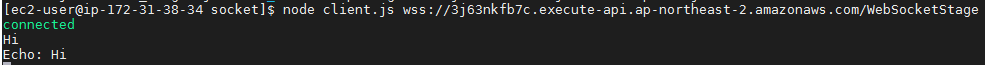
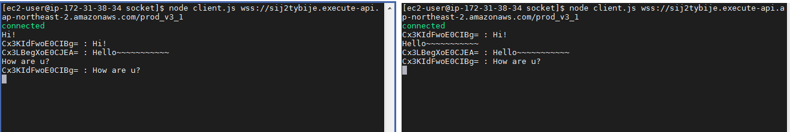

# AWS Lambda를 이용한 Serverless Socket
## 🎁 목차
- [AWS Lambda를 이용한 Serverless Socket](#aws-lambda를-이용한-serverless-socket)
  - [🎁 목차](#-목차)
  - [0. 개요](#0-개요)
  - [1. 일반적인 소켓통신](#1-일반적인-소켓통신)
    - [1.1. Socket Example](#11-socket-example)
  - [2. 서버리스 소켓통신](#2-서버리스-소켓통신)
    - [2.1. Serverless Socket Example 1](#21-serverless-socket-example-1)
      - [2.1.1. AWS Lambda 생성](#211-aws-lambda-생성)
      - [2.1.2. AWS API Gateway 생성](#212-aws-api-gateway-생성)
      - [2.1.3. Execute](#213-execute)
    - [2.2. Serverless Socket Example 2](#22-serverless-socket-example-2)
      - [2.2.1. AWS Lambda 작성](#221-aws-lambda-작성)
      - [2.2.2. Dynamo DB 생성](#222-dynamo-db-생성)
      - [2.2.3. AWS API Gateway 생성](#223-aws-api-gateway-생성)
      - [2.2.4. Execute](#224-execute)
      - [2.2.5. 기타](#225-기타)


## 0. 개요
소켓통신은 소켓서버가 필수로 요구된다.
때문에 언제 접속할지 모르는 client를 위해 서버를 계속 가동하고 있어야 한다.
  * AWS API Gateway + AWS Lambda를 이용항 Serverless socket
  
```c
// 구조도
                            Client
                                │
  ┌────────────────────── AWS API Gateway ──────────────────────┐
  │                                                             │
  │ $onConnection             echo             $onDisconnection │
  └───────┼─────────────────────┼──────────────────────┼────────┘ 
          │                     │                      │
    AWS Lambda             AWS Lambda             AWS Lambda 
          │                     │                      │
          └─────────────────────┼──────────────────────┘
                          ┌─────┴─────┐
                          │ Dynamo DB │
                          └───────────┘
```

## 1. 일반적인 소켓통신
  * [참고 링크](https://hackernoon.com/websockets-api-gateway-9d4aca493d39)

### 1.1. Socket Example
* client.js
```js
const WebSocket = require('ws');
const readline = require('readline');

const url = process.argv[2];
const ws = new WebSocket(url);

ws.on('open', () => console.log('connected'));
ws.on('message', data => console.log(`${data}`));
ws.on('close', () => {
        console.log('disconnected');
        process.exit();
});

const r1 = readline.createInterface({
        input: process.stdin,
        output: process.stdout,
});

r1.on('line', data => {
        const message = JSON.stringify({action: 'echo', data: data});
        ws.send(message);
});
```

* server.js
```js
const WebSocket = require('ws');
const short = require('short-uuid');

const connections = {};
const send = (connectionId, data) => {
  const connection = connections[connectionId];
  connection.send(data);
}

const defaultActions = {
  connect: (connection) => {
    const id = short.generate();
    connection.connectionId = id
    connections[id] = connection;
    console.log(`client connected with connectionId: ${id}`);
    customActions.connect && customActions.connect(id);
  },
  disconnect: (connectionId) => {
    delete connections[connectionId];
    console.log(`client disconnected with connectionId: ${connectionId}`);
    customActions.disconnect && customActions.disconnect(connectionId);
  },
  default: (connectionId, message) => {
    customActions.default ? customActions.default(connectionId) :
      send(connectionId, message ? `unrecognized action: ${message.action}`
        : `message cannot be empty`)
  },
};

const customActions = {
  echo: (connectionId, data) => {
    send(connectionId, data);
  }
};

const wss = new WebSocket.Server({ port: 8080 });
wss.on('connection', socket => {
  defaultActions.connect(socket);
  socket.on('message', messageJson => {
    console.log(`Received: ${messageJson}`);
    try {
      const { action, data } = JSON.parse(messageJson);
      // call the matching custom handler, else call the default handler
      const customHandler = customActions[action];
      customHandler ? customHandler(socket.connectionId, data) :
        defaultActions.default(socket.connectionId, { action, data });
    } catch (ex) {
      console.error(ex);
      socket.send(`Bad Request format, use: '{"action": ..., "data": ...}'`);
    }
  });
  socket.on('close', () => {
    defaultActions.disconnect(socket.connectionId);
  });
});

console.log(`Listening on ws://localhost:8080`);
``` 

* Execute
```bash
# Console 1
node server.js
# Console 2
node client.js ws://localhost:8080
``` 

## 2. 서버리스 소켓통신
### 2.1. Serverless Socket Example 1
#### 2.1.1. AWS Lambda 생성
1. AWS -> 서비스 -> Lambda 선택
2. Create Function 클릭
3. 새로작성<br>함수이름: WebSocketFunc<br>실행 역할을 선택하거나 생성 클릭<br>기본 Lambda 권한을 가진 새 역할 생성 체크<br>Create Function 클릭
4. index.js 편집
```js
// apply the patch
require('./patch.js');

const AWS = require('aws-sdk');
let send = undefined;

function init(event) {
  const apigwManagementApi = new AWS.ApiGatewayManagementApi({
    apiVersion: '2018-11-29',
    endpoint: event.requestContext.domainName + '/' + event.requestContext.stage
  });
  send = async (connectionId, data) => {
    await apigwManagementApi.postToConnection({ ConnectionId: connectionId, Data: `Echo: ${data}` }).promise();
  }
}

exports.handler = async(event) => {
  init(event);
  const connectionId = event.requestContext.connectionId;
  let data = JSON.parse(event.body).data
  await send(connectionId, data);
  // the return value is ignored when this function is invoked from WebSocket gateway
  return {};
};
```
5. index.js와 동일 경로에 patch.js 생성
```js
require('aws-sdk/lib/node_loader');
var AWS = require('aws-sdk/lib/core');
var Service = AWS.Service;
var apiLoader = AWS.apiLoader;

apiLoader.services['apigatewaymanagementapi'] = {};
AWS.ApiGatewayManagementApi = Service.defineService('apigatewaymanagementapi', ['2018-11-29']);
Object.defineProperty(apiLoader.services['apigatewaymanagementapi'], '2018-11-29', {
  get: function get() {
    var model = {
      "metadata": {
        "apiVersion": "2018-11-29",
        "endpointPrefix": "execute-api",
        "signingName": "execute-api",
        "serviceFullName": "AmazonApiGatewayManagementApi",
        "serviceId": "ApiGatewayManagementApi",
        "protocol": "rest-json",
        "jsonVersion": "1.1",
        "uid": "apigatewaymanagementapi-2018-11-29",
        "signatureVersion": "v4"
      },
      "operations": {
        "PostToConnection": {
          "http": {
            "requestUri": "/@connections/{connectionId}",
            "responseCode": 200
          },
          "input": {
            "type": "structure",
            "members": {
              "Data": {
                "type": "blob"
              },
              "ConnectionId": {
                "location": "uri",
                "locationName": "connectionId"
              }
            },
            "required": [
              "ConnectionId",
              "Data"
            ],
            "payload": "Data"
          }
        }
      },
      "shapes": {}
    }
    model.paginators = {
      "pagination": {}
    }
    return model;
  },
  enumerable: true,
  configurable: true
});

module.exports = AWS.ApiGatewayManagementApi;
```

#### 2.1.2. AWS API Gateway 생성
1. AWS -> 서비스 -> API Gateway 선택
2. API 작성 클릭
3. 프로토콜 선택: WebSocket
4. API 이름: WebSocket<br>경로 선택 표현식: $request.body.action
5. 새 경로 키 박스에 "echo"입력 후 오른쪽 체크아이콘 클릭
6. 통합 유형: Lambda 함수<br>Lambda 리전: Lambda 함수를 만든 리전<br>Lambda함수: WebSocketFunc
7. 저장
8. "작업"메뉴 드랍 -> API 배포 
9. 배포 스테이지: [새 스테이지]<br>스테이지 이름: WebSocketStage
10. WebSocket URL 복사

#### 2.1.3. Execute
```bash
# ex) $WEB_SOCKET_URL: wss://1234567890.execute-api.ap-northeast-2.amazonaws.com/WebSocketStage 
node client.js $WEB_SOCKET_URL

# 아래와 같은 결과가 출력된다.
```
* 

### 2.2. Serverless Socket Example 2
* 2.1. 에서 서버리스 소켓통신이 가능하다는 사실을 알게되었다.
  이제 Dynamo DB에 ConnectionId를 저장하고, 연결된 Client 모두에게 메세지를 BroadCast 할 것이다.
* 전체적인 로직은 이렇다.
  1. 소켓에 연결되면 ConnectionId를 부여하고, DynamoDB에 저장한다.
  2. 메세지를 보내면 DB를 탐색하여 현재 연결된 Client들에게 Broadcasting 한다.
  3. 소켓 연결이 해제되면 자신의 ConnectionID를 DB에서 삭제한다.

#### 2.2.1. AWS Lambda 작성
|Lambda 함수 이름|핸들러|환경 변수|File|역할(role)|
|:-:|:-:|:-:|:-:|:-:|
|WSDemoEchoHandler_onConnection|app.handler|Key: TABLE_NAME<br>Value: WSDemo|./WSDemoEchoHandler_onConnection/*|파일첨부|
|WSDemoEchoHandler|index.handler|Key: TABLE_NAME<br>Value: WSDemo|./WSDemoEchoHandler/*|사진 첨부(Basic Execution Role + 나머지|
|WSDemoEchoHandler_onDisconnection|app.handler|Key: TABLE_NAME<br>Value: WSDemo|./WSDemoEchoHandler_onDisconnection/*|파일첨부|

#### 2.2.2. Dynamo DB 생성
1. AWS -> 서비스 -> DynamoDB
2. 대시보드 -> 테이블 만들기
3. 테이블 이름: WSDemo<br>기본 키: connectionId
4. 생성

#### 2.2.3. AWS API Gateway 생성
1. AWS -> 서비스 -> API Gateway
2. API 선택
3. $connect 클릭
4. WSDemoEchoHandler_onConnection 매핑
5. $disconnect 클릭
6. WSDemoEchoHandler_onDisconnection 매핑
7. 새 경로 생성 "echo"
8. WSDemoEchoHandler 매핑
9. API 배포

#### 2.2.4. Execute
* 2개의 Console로 진행.
  


#### 2.2.5. 기타
* 위의 role대로 설정을 했다면 AWS CloudWatch가 각 서비스를 로깅한다.
* Forbidden : API Gateway에 접근이 되나 의심
* Internal server error : API Gateway에는 접근 했으나 서버에서 에러 발생
주로 role일 가능성이 농후. (AWS IAM 사용법 숙지)

---
