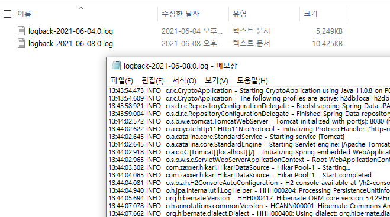

# Spring-boot Logback을 활용한 로그저장

## 🎁 목차
- [Spring-boot Logback을 활용한 로그저장](#spring-boot-logback을-활용한-로그저장)
  - [🎁 목차](#-목차)
  - [개요](#개요)
  - [0. Dependencies 추가](#0-dependencies-추가)
  - [1. `logback.xml` 생성](#1-logbackxml-생성)
  - [2. 확인](#2-확인)

## 개요
Spring-boot을 실행하면 console에 다양한 로그들이 찍힌다.
해당 로그들은 휘발성으로 따로 저장하지 않으면 사라진다.
본 장에서는 logback을 활용하여 console log들을 저장하는 방법을 다룬다.

## 0. Dependencies 추가
`build.gradle`에 logback관련 라이브러리를 추가한다.
```gradle
dependencies {
	implementation (
		'ch.qos.logback:logback-classic:1.2.3',
		'ch.qos.logback:logback-core:1.2.3',
	)
}
```

## 1. `logback.xml` 생성
`resource`폴더 아래에 `logback.xml`을 위치시킨다.
```xml
<?xml version="1.0" encoding="UTF-8"?>
<!--
 [Layout]
 %m : 로그내용이 출력
 %p : trace > debug > info > warn > error 등의 priority 출력
 %r : 어플리케이션이 시작되어 로깅이벤트가 발생하는 시점까지의 경과시간을 밀리세컨드로 출력
 %c : 예) 카테고리가 a.b.c 처럼 되어있다면 %c{2}는 b.c가 출력됩니다.
 %n :  플랫폼 종속적인 개행문자가 출력된다. \r\n 또는 \n 일것이다
 %d : 로깅이벤트가 일어나 날짜 출력 ( 프로그램의 실행속도를 느리게 한다.)
     예) %d{HH:mm:ss} 또는 %d{dd MMMM yyyy HH:mm:ss}
 %C : 호출자의 클래스명 출력
    예) 클래스구조가 org.apache.xyz.SomeClass 처럼 되어있다면 %C{2}는 xyz.SomeClass 가 출력됩니다
 %M : 로깅이 발생한 method 이름을 나타냅니다.
 %F : 로깅이 발생한 프로그램 파일명을 나타냅니다.
 %l : 로깅이 발생한 caller의 정보를 나타냅니다 
 %L : 로깅이 발생한 caller의 라인수를 나타냅니다 
 %x : 로깅이 발생한 thread와 관련된 NDC(nested diagnostic context)를 출력합니다. 
 %X : 로깅이 발생한 thread와 관련된 MDC(mapped diagnostic context)를 출력합니다. 
 %% : % 표시를 출력하기 위해 사용한다.  
 %t : 로그이벤트가 발생된 쓰레드의 이름을 출력합니다
-->
<configuration scan="true" scanPeriod="30 seconds">
    
    <appender name="ROLLING" class="ch.qos.logback.core.rolling.RollingFileAppender">
        <rollingPolicy class="ch.qos.logback.core.rolling.TimeBasedRollingPolicy">
            <!-- rollover daily -->
            <fileNamePattern>D:\log\logback\logback-%d{yyyy-MM-dd}.%i.log</fileNamePattern>
            <timeBasedFileNamingAndTriggeringPolicy class="ch.qos.logback.core.rolling.SizeAndTimeBasedFNATP">
                <!-- or whenever the file size reaches 100MB -->
                <maxFileSize>100MB</maxFileSize>
            </timeBasedFileNamingAndTriggeringPolicy>
        </rollingPolicy>
        <encoder>
            <pattern>%d{HH:mm:ss.SSS} %-5level %logger{36} - %msg%n</pattern>
        </encoder>
    </appender>
    <appender name="STDOUT" class="ch.qos.logback.core.ConsoleAppender">
        <layout class="ch.qos.logback.classic.PatternLayout">
            <Pattern>%d{HH:mm:ss.SSS} [%-5level] - %msg%n</Pattern>
        </layout>
    </appender>
    
    <!-- Loggers -->
    <!-- <logger name="org.apache.catalina" level="ERROR">
    </logger>
    
    <logger name="org.apache.commons" level="ERROR">
    </logger>
    
    <logger name="org.springframework" level="DEBUG" >
    </logger>
    
    <logger name="egovframework.*" level="DEBUG">
    </logger>
    
    <logger name="java.sql" level="DEBUG">
    </logger>
    
    <logger name="org.mybatis.spring" level="DEBUG">
    </logger>
    
    <logger name="egovframework.sqlmappers" level="TRACE">
    </logger> -->
    
    <root level="INFO">
       <appender-ref ref="ROLLING"/>
       <appender-ref ref="STDOUT" />
    </root>
</configuration>
```

- `<fileNamePattern>D:\log\logback\logback-%d{yyyy-MM-dd}.%i.log</fileNamePattern>`
  - 로그파일의 이름과 저장할 위치를 명시한다.

## 2. 확인
spring-boot을 실행시키고 해당 경로에 로그파일이 정상적으로 저장되는지 확인한다.



---