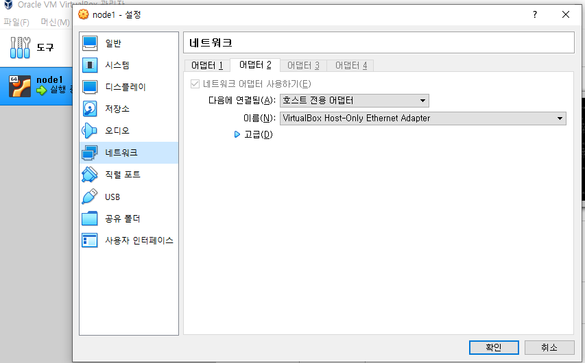
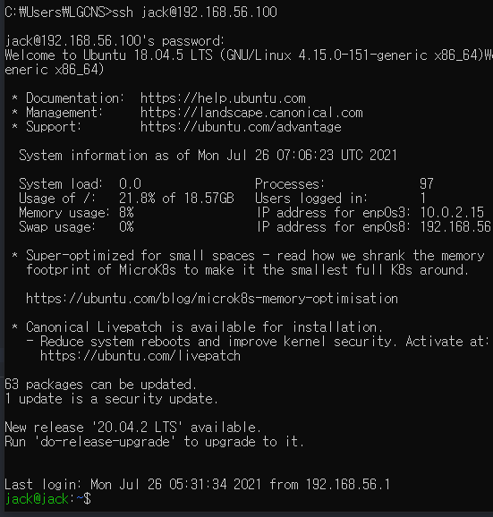

# VM에 Static IP 설정하기

## 🎁 목차
- [VM에 Static IP 설정하기](#vm에-static-ip-설정하기)
  - [🎁 목차](#-목차)
  - [개요](#개요)
  - [1. Network interface 추가](#1-network-interface-추가)
    - [1.1. Oracle VM Virtual Box 설정](#11-oracle-vm-virtual-box-설정)
    - [1.2. 확인](#12-확인)
  - [2. Static IP 설정](#2-static-ip-설정)
    - [2.1. NAT](#21-nat)
    - [2.2. 호스트 전용 어댑터](#22-호스트-전용-어댑터)
    - [2.3. 적용](#23-적용)
  - [3. 확인](#3-확인)
    - [3.1. `ifconfig`](#31-ifconfig)
    - [3.2. VM - 호스트](#32-vm---호스트)
    - [3.3. VM - 외부 네트워크](#33-vm---외부-네트워크)
    - [3.4. 유의사항](#34-유의사항)

## 개요
VM에서 Static IP를 사용하기 위한 가이드이다.
vm과 외부와의 통신은 **NAT**로, vm들과 호스트의 통신은 **호스트 전용 어댑터**를 사용한다.
본 문서는 `Oracle VM Virtual Box`를 이용하여 VM을 띄웠고, OS는 ubuntu 18.04.5를 사용한다.

## 1. Network interface 추가
### 1.1. Oracle VM Virtual Box 설정
- 해당 VM 우클릭 -> 설정 -> 네트워크 -> 어댑터 2 -> 호스트 전용 어댑터
선택 후 확인


### 1.2. 확인
vm을 가동한 후 `ifconfig -a`으로 결과를 확인해보자.
`enp0s8`이라는 네트워크 인터페이스가 추가된 것을 확인할 수 있을 것이다.

## 2. Static IP 설정
이제 `enp0s8`에 Static IP를 설정해보자.
다음 경로를 확인해본다.

### 2.1. NAT
`enp0s3`은 NAT로 vm과 외부와의 통신을 가능하게 해준다.
NAT에 `gateway4`설정을 해줌으로써 외부와의 통신을 가능하게 해준다.

> Ubuntu 18.04.5 기준이다.
```sh
$ ls /etc/netplan
00-installer-config.yaml

$ vim /etc/netplan/00-installer-config.yaml
```
```yaml
network:
  ethernets:
    enp0s3:
      dhcp4: true
      addresses: []
      gateway4: 192.168.56.1
  version: 2
```

### 2.2. 호스트 전용 어댑터
방금 추가한 `enp0s8`네트워크 인터페이스로 vm의 static ip를 설정하고, vm간 통신을 가능하게 해줄것이다.
`/etc/netplan`하위에 새로운 파일을 추가한다.
```sh
$ sudo vim /etc/netplan/01-netcfg.yaml
```
```yaml
network:
  version: 2
  renderer: networkd
  ethernets:
    enp0s8:
      dhcp4: no
      dhcp6: no
      addresses: [192.168.56.100/24]
      nameservers:
        addresses: [8.8.8.8,8.8.4.4]
```

### 2.3. 적용
```sh
sudo netplan apply
```

## 3. 확인

### 3.1. `ifconfig`
`enp0s8`에 static ip가 할당된 것을 확인할 수 있다.
```sh
$ ifconfig
enp0s3: flags=4163<UP,BROADCAST,RUNNING,MULTICAST>  mtu 1500
        inet 10.0.2.15  netmask 255.255.255.0  broadcast 10.0.2.255
        inet6 fe80::a00:27ff:fe65:12b  prefixlen 64  scopeid 0x20<link>
        ether 08:00:27:65:01:2b  txqueuelen 1000  (Ethernet)
        RX packets 84  bytes 16268 (16.2 KB)
        RX errors 0  dropped 0  overruns 0  frame 0
        TX packets 151  bytes 17050 (17.0 KB)
        TX errors 0  dropped 0 overruns 0  carrier 0  collisions 0

enp0s8: flags=4163<UP,BROADCAST,RUNNING,MULTICAST>  mtu 1500
        inet 192.168.56.100  netmask 255.255.255.0  broadcast 192.168.56.255
        inet6 fe80::a00:27ff:fe7e:e27a  prefixlen 64  scopeid 0x20<link>
        ether 08:00:27:7e:e2:7a  txqueuelen 1000  (Ethernet)
        RX packets 1329  bytes 109329 (109.3 KB)
        RX errors 0  dropped 0  overruns 0  frame 0
        TX packets 1155  bytes 133949 (133.9 KB)
        TX errors 0  dropped 0 overruns 0  carrier 0  collisions 0

lo: flags=73<UP,LOOPBACK,RUNNING>  mtu 65536
        inet 127.0.0.1  netmask 255.0.0.0
        inet6 ::1  prefixlen 128  scopeid 0x10<host>
        loop  txqueuelen 1000  (Local Loopback)
        RX packets 94  bytes 7240 (7.2 KB)
        RX errors 0  dropped 0  overruns 0  frame 0
        TX packets 94  bytes 7240 (7.2 KB)
        TX errors 0  dropped 0 overruns 0  carrier 0  collisions 0
```

### 3.2. VM - 호스트
Window에서 커맨드창을 열어 ssh로 붙어보자.


위의 결과를 통해 호스트 -> vm간의 통신이 된다는 것을 확인할 수 있다.

### 3.3. VM - 외부 네트워크
이제 vm과 외부 네트워크와의 연결을 확인해보자.
```sh
$ nslookup google.com
Server:         127.0.0.53
Address:        127.0.0.53#53

Non-authoritative answer:
Name:   google.com
Address: 216.58.197.206
Name:   google.com
Address: 2404:6800:4004:80e::200e
```

다음 결과를 통해 vm이 외부 네트워크와 통신할 수 있음을 확인할 수 있다.

### 3.4. 유의사항
필자는 Virtual Box에서 **NAT와 호스트 전용 어댑터**를 사용했다.
이 두가지를 동시에 사용했을 때, enp0s8에 `gateway4`를 추가하면 외부통신이 안된다.
